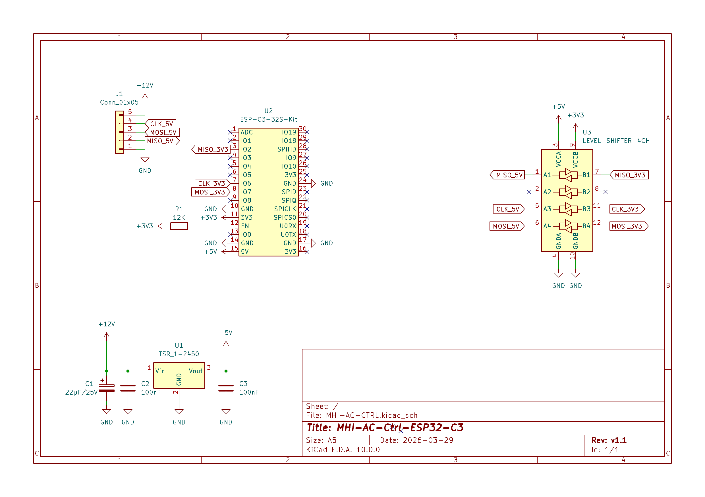
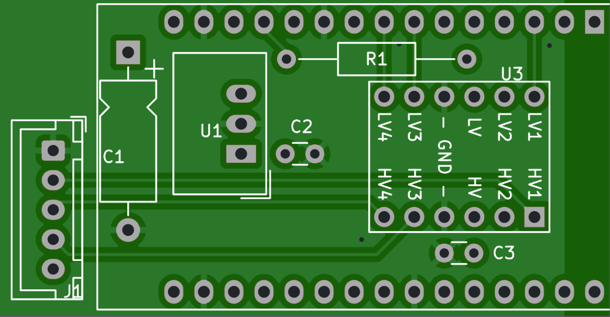
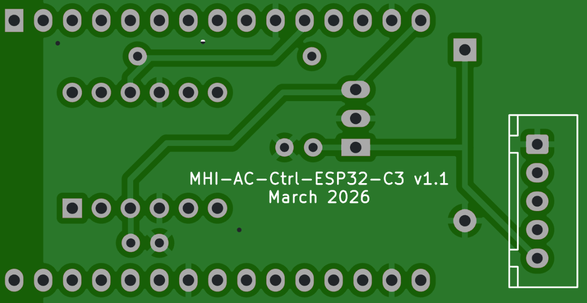
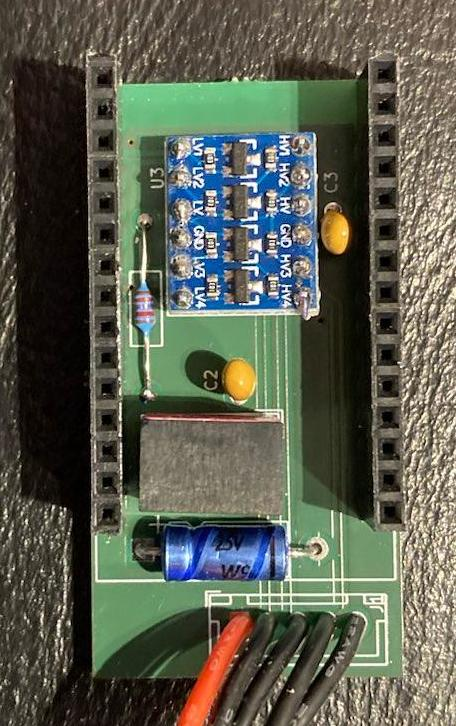
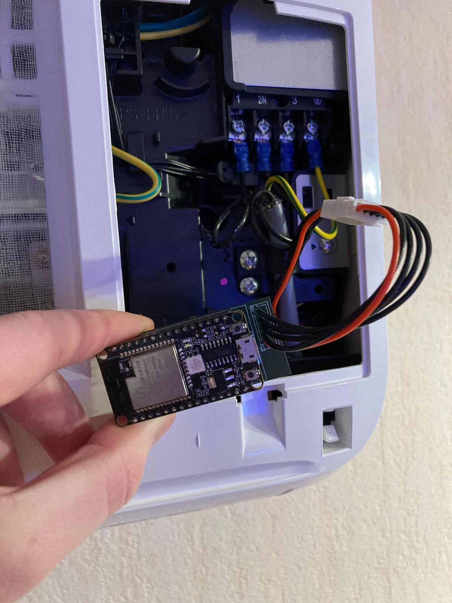
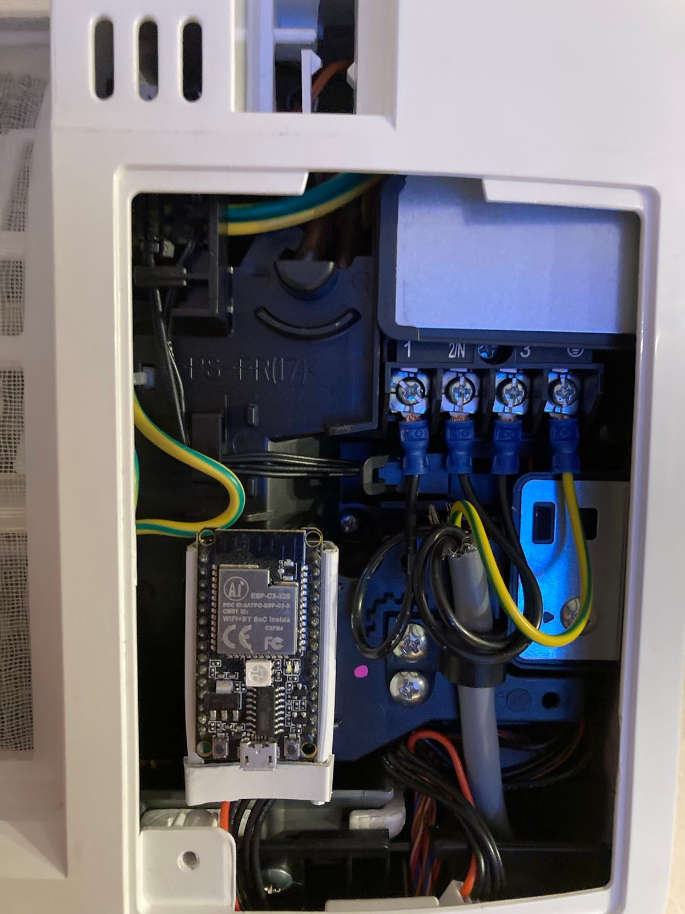

# Hardware

## Schematic

## PCB (KiCad)

You find the KiCad schematic and the layout in the [kicad folder](kicad). I used this KiCad project for the PCB order at [Aisler](https://aisler.net).

## Bill of Material
Part |Value            |Package                    |comment
---- | ----            |----                       |-----
C1   |22µ/25V          |E15-5 (axial)              |consider the polarity
C2, C3   |100n             |C025-024X044
U1   |[TSR_1-2450](https://www.aliexpress.com/item/1005004319529660.html)       |TSR-1                      |consider the polarity  1
U2  |[ESP-C3-32S(4M)-KIT](https://www.aliexpress.com/item/1005003152986418.html)    |ESP-C3-32S(4M)-KIT              |consider the polarity
U3  |LEVEL-SHIFTER-4CH|LEVEL-SHIFTER-4CH          |consider the polarity
R1   | 12K        |                      | Optional 2

1According to the discussions [here](https://github.com/absalom-muc/MHI-AC-Ctrl/issues/102) and [here](https://github.com/absalom-muc/MHI-AC-Ctrl/issues/17) TSR 1-2450 can be replaced by TSR 1-2450E.

2The documentation of AI-Thinker says this one should be connected, though the USB-Serial chip already pulls this pin.

## Assembled PCB
The following photos show the assembled PCB

## Connector
The AC provides the signals via the CNS connector. It has 5 pins with a pitch of 2.5 mm. It is out of the [XH series from JST](http://www.jst-mfg.com/product/detail_e.php?series=277). The position of the connector is visible on the following photo of the AC indoor unit PCB.

The PCB of the remote control uses a pin connector out of [JST JQ series](https://jst.de/file/download/124/pitch-2-5-mm-btb-jq-pdf) also with a pitch of 2.5 mm. So the board can be directly plugged into the board of the AC.
 
It was not tested to directly plug the MHI-AC-Ctrl-ESP32-C3 into the AC unit. Instead, we recommend using an extender cable (called "4S balancer JST-XH extension cable" with one male and one female connector), e.g. https://www.aliexpress.com/item/1005003669930722.html. On the board, you can solder a cable, e.g. https://www.aliexpress.com/item/4000800420412.html. 

:warning: **Opening of the indoor unit should be done by a qualified professional because faulty handling may cause leakage of water, electric shock or fire!** :warning:

## Power Supply
The JST connector provides +12V. The DC-DC converter [TSR 1-2450](https://www.tracopower.com/products/browse-by-category/find/tsr-1/3/) converts the +12V to +5V.

## Signal Connection
The ESP32-C3 SPI signals SCL (SPI clock), MOSI (Master Out Slave In) and MISO (Master In Slave Out) are connected via a voltage level shifter 5V <-> 3.3V with the AC. Direct connection of the signals without a level shifter could damage your ESP32-C3! Note that the CNS connector does not provide a Chip Select signal, this is generated internally on the ESP32-C3 and routed back through IO9 and IO10.
